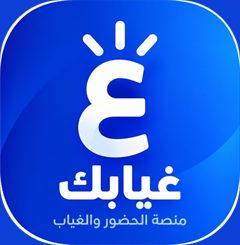

# 🎓 منصة غيابك (Ghyabak Platform)

<div align="center">

  

  ### **منصة الحضور والغياب الذكية للمدرسين والطلاب**
  **تسجيل الحضور بمسحة QR واحدة.. من غير ورق ولا لخبطة حسابات!**

  [](https://developer.mozilla.org/en-US/docs/Web/HTML)
  [](https://developer.mozilla.org/en-US/docs/Web/CSS)
  [](https://developer.mozilla.org/en-US/docs/Web/JavaScript)
  [](https://supabase.com)
  [](https://vercel.com)
  [](https://web.dev/progressive-web-apps/)

</div>

---

## 👥 فريق العمل والمطورين (The Dream Team)

تم بناء وتطوير منصة **غيابك** بالكامل بتعاون احترافي بين:

<div align="center">

| المطور | الدور والمسؤولية | التخصص |
| :--- | :--- | :--- |
| 🧑‍💻 **مسلم إبراهيم** | **Front-End Developer** | واجهات المستخدم، تجربة المستخدم (UI/UX)، الـ PWA، وتحسين الأداء و Lighthouse |
| ⚙️ **سيف سعد** | **Back-End Developer** | هندسة قواعد البيانات Supabase، حماية الـ RLS، والأمن السيبراني والـ API |

</div>

---

## 💡 فكرة المشروع (Project Concept)

منصة **غيابك** هي الحل العصري لمشكلة أخذ الحضور والغياب وحسابات المجموعات الدراسية (السناتر والمدرسين الخصوصيين). بدلاً من السجلات الورقية وضياع الوقت في نداء الأسماء، المنصة بتقدم:

1. **للطالب:** كارنيه رقمي ذكي مزود بـ **QR Code** فريد وكود طالب ثابت، بيقدر يحفظه على موبايله أو يطبعه.
2. **للمدرس:** لوحة تحكم كاملة بيفتح فيها الكاميرا ويمسح كود الطالب في أجزاء من الثانية، والسيستم بيسجل الحضور، وبيحسب المستحقات المالية على قد الحصص اللي حضرها الطالب فعلياً!

---

## ✨ المميزات الرئيسية (Key Features)

### 📲 1. بوابة الطالب (`index.html`)
* **إنشاء حساب بسيط:** تسجيل سريع برقم الهاتف والمحافظة والصف الدراسي والشعبة.
* **كارنيه QR تلقائي:** أول ما الطالب بيسجل، المنصة بتولدله كود طالب وكارنيه QR خاص بيه.
* **تحميل وطباعة:** إمكانية تحميل صورة الـ QR أو طباعة الكارنيه بضغطة زر.
* **سجل الحضور الشفاف:** الطالب يقدر يتابع كل الحصص اللي حضرها بتاريخها وميعاد المجموعة.
* **حسابات دقيقة:** المبلغ المستحق بيتحسب بناءً على الحصص الفعلية اللي حضرها الطالب بدون ظلم.
* **تعديل البيانات:** إدارة أرقام التليفون وتغيير كلمة السر في أي وقت وأمان تام.

### 🏫 2. لوحة تحكم المدرس (`teacher.html`)
* **إدارة المجموعات والمواعيد:** إضافة وتعديل مجموعات الدروس لكل صف دراسي بأيامها ومواعيدها.
* **قارئ الـ QR والاسكانر الحي:** تسجيل الحضور عن طريق كاميرا الموبايل/الكمبيوتر، أو صوّر الـ QR، أو بإدخال الكود يدويًا/جهاز البار Florent.
* **منع التكرار التلقائي:** لو الطالب اتكشف كوده مرتين في نفس الحصة، السيستم بيديك تنبيه ويمنع التكرار.
* **سجل الحضور والغياب الشامل:** كشف كامل متكامل بكل حصة ومين حضر ومين غاب.
* **نظام الحسابات والمدفوعات:** 
  * تحديد سعر الصف وعدد الحصص.
  * فلترة الطلاب (دفع / لم يدفع).
  * حساب المبالغ المستحقة لكل طالب تلقائياً.
* **تصدير التقارير وطباعة الكروت:**
  * تصدير كشوف الحضور والحسابات لـ **PDF**.
  * تصدير بيانات الطلاب كملف **Excel / CSV**.
  * **طباعة كروت الـ QR للطلاب:** تجهيز كروت الطلاب على أوراق A4 جاهزة للطباعة والقص مباشرة!

---

## 🛠️ التكنولوجيات المستخدمة (Tech Stack)

تم اختيار التكنولوجيات بعناية لضمان سرعة فائقة، أداء عالي، وسهولة في الصيانة:

* **Frontend:**
  * `HTML5` (Semantic HTML structure with Web Vitals Optimization).
  * `CSS3` (Custom CSS with CSS Variables, Flexbox, Grid, fully responsive for all screen sizes).
  * `JavaScript (Vanilla ES6+)` (No heavy frameworks - Blazing fast performance).
  * `PWA (Progressive Web App)` (Service Worker, Web App Manifest - التطبيق قابل للتثبيت على الموبايل ويدعم الـ Offline caching).

* **Libraries & Tools:**
  * `qrcode-generator` (توليد أكواد الـ QR بكفاءة عالية وبدون استهلاك للذاكرة).
  * `@supabase/supabase-js` (ربط واجهة المستخدم مع قاعدة البيانات فورياً).

* **Backend & Database:**
  * `Supabase` (PostgreSQL Database, Realtime Subscriptions, Database Functions).
  * `Row Level Security (RLS)` (حماية مشددة لمنع أي تلاعب بالبيانات من طرف العميل).

* **Hosting & Infrastructure:**
  * `Vercel` (مستضيف واجهة التطبيق مع دعم Edge Network / CDN لسرعة التحميل في مصر والعالم).

---

## 📂 البنية المعمارية للملفات (Project Structure)

```text
ghyabak/
├── 📄 index.html              # بوابة الطالب (تسجيل الدخول، الكارنيه، سجل الحضور)
├── 📄 teacher.html            # لوحة تحكم المدرس (تسجيل الحضور، المجموعات، الحسابات)
├── 🎨 style.css               # التصميم الموحد ونظام الألوان المتجاوب
├── ⚙️ config.js               # إعدادات الربط مع Supabase
├── 📜 app.js                  # المنطق البرمجي لبوابة الطالب
├── 📜 teacher.js              # المنطق البرمجي للوحة المدرس وقارئ الـ QR
├── 📱 pwa.js                  # إدارة الـ Service Worker والتثبيت كتطبيق
├── 📑 manifest.webmanifest    # إعدادات PWA للطالب
├── 📑 manifest-teacher.webmanifest # إعدادات PWA للمدرس
├── 🖼️ icons/                  # أيقونات التطبيق واللوجو بمختلف الأبعاد
└── 🗄️ database/               # ملفات الـ SQL لشفرات قواعد البيانات والـ RLS Policies
```

---

## 🔒 الأمان وقواعد البيانات (Security & RLS)

تم خضوع المنصة لـ **Security Audit** شامل للتأكد من عدم وجود أي ثغرات:

1. **تفعيل سياسات Row Level Security (RLS):**
   * الطالب لا يستطيع قراءة بيانات طلاب آخرين أو سحب أرقام هواتفهم.
   * لا يمكن لأي طالب حقن سجلات حضور لنفسه عن طريق الـ Console في المتصفح؛ حيث يرفض Supabase الطلب برمز `401 Unauthorized` فوراً.
   * المدرس المعتمد فقط هو من يملك صلاحية تعديل جدول الحضور والمجموعات.
2. **تأمين كلمة السر والبيانات:** البيانات مشفرة ومؤمنة بالكامل على خوادم Supabase.

---

## ⚡ الأداء واختبارات الضغط (Performance & Load Testing)

تم تحسين أداء المنصة لتستجيب في أجزاء من الثانية تحت أقصى درجات الضغط:

* **Lighthouse Score:** تم تحسين زمن القراءة البصرية (LCP و FCP) عبر تقنيات `Resource Preloading` و `Minified Libraries` و `Image Aspect Ratio Optimization`.
* **k6 Stress Testing:** خضعت المنصة لاختبار ضغط بـ **100 طلب متزامن في نفس الملي ثانية (Concurrent Requests)**:
  * **نسبة النجاح:** 100% بدون أي انقطاع أو سقوط للسيرفر (Zero Crashes).
  * **معدل الاستجابة:** متوسط **55 ملي ثانية** فقط لكل طلب!

---

## 💻 طريقة التشغيل والتطوير المحلي (Getting Started)

لو حابب تشغل المشروع عندك على الجهاز للمعاينة أو التعديل:

1. **اعمل Clone للمشروع:**
   ```bash
   git clone https://github.com/your-username/ghyabak.git
   cd ghyabak
   ```

2. **إعداد قاعدة البيانات (Supabase):**
   * قم بإنشاء مشروع جديد على [Supabase](https://supabase.com).
   * قم بتشغيل سكربتات الـ SQL الموجودة داخل مجلد `database/` في الـ SQL Editor لإنشاء الجداول والجداول المرجعية وتفعيل الـ RLS.

3. **إعداد ملف التكوين (`config.js`):**
   ضع رابط مشروعك والـ Anon Key داخل `config.js`:
   ```javascript
   const SUPABASE_URL = 'https://YOUR_PROJECT_ID.supabase.co';
   const SUPABASE_ANON_KEY = 'YOUR_ANON_KEY';
   ```

4. **التشغيل:**
   * افتح ملف `index.html` أو `teacher.html` مباشرة في المتصفح أو استخدم إضافة `Live Server` في VS Code!

---

## 📱 تجربة الـ PWA وتثبيت التطبيق

المنصة مصممة كـ **Progressive Web App (PWA)**:
* يمكن للطالب أو المدرس اضغط على زر **"ثبّت التطبيق"** في أعلى الصفحة.
* ينزل التطبيق على شاشة الموبايل الرئيسية كأنه تطبيق Android / iOS طبيعي بدون الحاجة للتحميل من المتجر!

---

<div align="center">

### 💚 تم التطوير بحب وإتقان بواسطة **مسلم إبراهيم** & **سيف سعد** 💚
**جميع الحقوق محفوظة © 2026 - منصة غيابك**

</div>
